# Distance study

our goal is to find adaptive loss function. (able to measure distribution concept)

### TODO List

- [x] L2 Loss
- [x] L1 Loss
- [x] BCE Loss
- [ ] EM divergence
- [ ] KL divergence
- [ ] JSD divergence

### Setting

- dataset: SKU110k dataset

```
in main.py 60 lines

images = datas[0]
boxes = datas[1]
labels = datas[2]
locations = datas[3]
cnt = datas[4]
map = datas[5] (Gaussian)

```


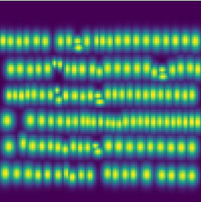

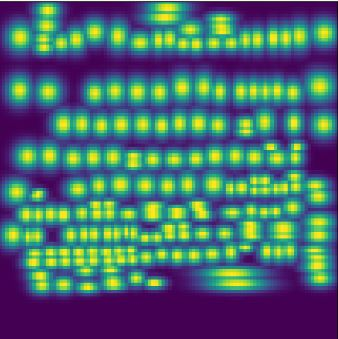

HD

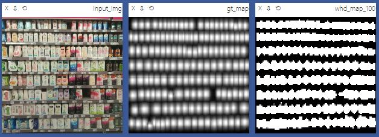

HD (Improved)

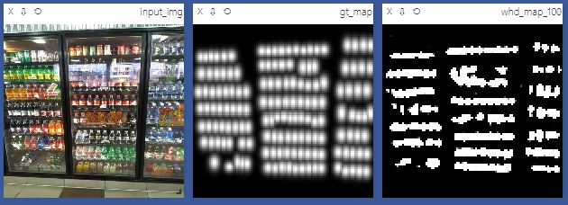

L1

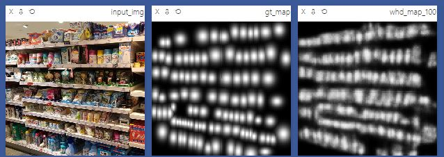

BCE

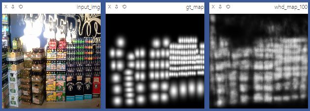

JSD

![] (./fig/jsd_loss.JPG)

HD + BCE

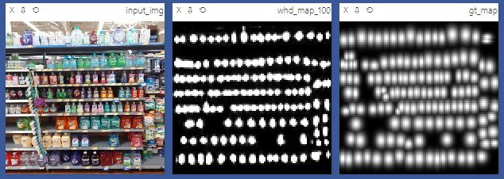
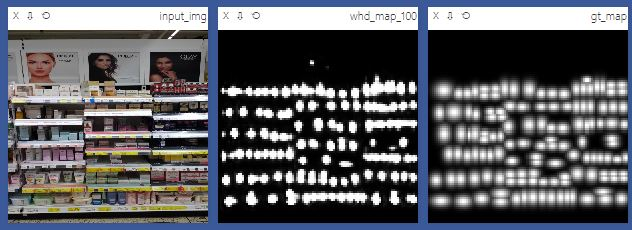
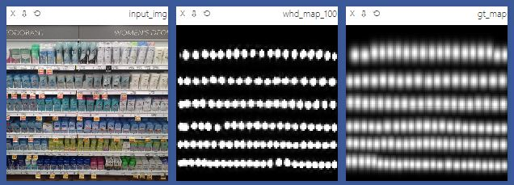
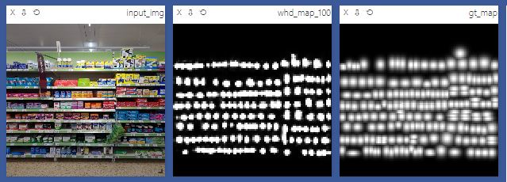
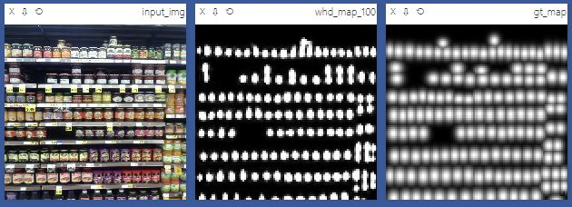
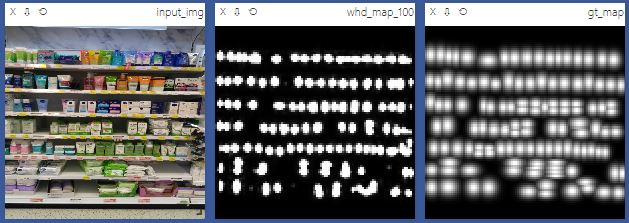

- model : depth-wise separable convolutional unet
- output of model : [B, 100, 100], [B]
